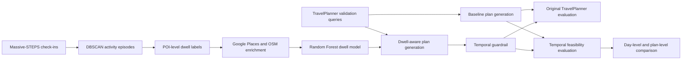
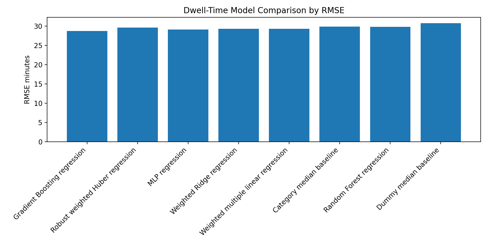

# Temporal-TravelPlanner

**Dwell-Time-Aware Itinerary Feasibility Evaluation**

Temporal-TravelPlanner is a research extension of [TravelPlanner](https://github.com/OSU-NLP-Group/TravelPlanner) that evaluates AI-generated travel itineraries as **time-constrained daily schedules**, not only as coherent collections of travel entities.

The project addresses a specific limitation in TravelPlanner-style evaluation: a generated itinerary may contain plausible attractions, meals, transport, and accommodation while still being impractical once the expected time spent at each attraction is included. Temporal-TravelPlanner makes attraction dwell time explicit during planning and adds a duration-budget evaluation layer for measuring day-level and complete-itinerary feasibility.

This repository accompanies the master's thesis:

> **Temporal-TravelPlanner: Dwell-Time-Aware Itinerary Feasibility Evaluation**  
> Arnav Negi, The University of Queensland, 2026

---

## Why Temporal-TravelPlanner?

TravelPlanner evaluates language-agent itineraries using delivery, commonsense, hard-constraint, and final pass metrics. These dimensions are important, but they do not fully determine whether a traveller could realistically complete the proposed schedule.

Temporal-TravelPlanner adds a complementary question:

> **Can the generated itinerary actually fit within the available time after attraction visits, meals, local movement, and transportation are considered?**

The project therefore focuses on temporal realism rather than claiming a general improvement across every original TravelPlanner benchmark dimension.

---

## Main Contributions

1. **Dwell-time label construction from mobility data**  
   Massive-STEPS semantic check-ins are converted into activity episodes using DBSCAN and aggregated into point-of-interest-level dwell labels.

2. **Supervised attraction dwell-time estimation**  
   POI labels are enriched with Google Places and OpenStreetMap features. Ridge, Huber, Random Forest, Histogram-Based Gradient Boosting, and Multi-Layer Perceptron regressors are compared.

3. **Dwell-aware TravelPlanner integration**  
   Predicted attraction dwell durations and empirical meal-duration estimates are incorporated into the TravelPlanner-style workflow.

4. **Temporal guardrail and evaluation framework**  
   A deterministic guardrail reduces overloaded attraction schedules, while day-level and plan-level metrics measure temporal feasibility, completeness, balance, under-planning, and temporal commonsense.

---

## System Overview



The workflow combines two development streams:

- a TravelPlanner-style itinerary-generation pipeline; and
- a dwell-time modelling pipeline based on semantic trajectory data.

Their outputs are joined during dwell-aware planning and evaluated using both the original benchmark metrics and the proposed temporal metrics.

---

## Dwell-Time Modelling

### Data preparation

The dwell-time pipeline was developed from approximately:

| Stage | Size |
|---|---:|
| Semantic check-ins | 1,322,295 |
| Unique POIs | 143,783 |
| Constructed activity episodes | 1,022,814 |
| Clean episode-duration observations | 117,579 |
| Labelled POIs used for supervised modelling | 3,346 |

Activity regions were constructed using DBSCAN with:

- neighbourhood radius: **100 metres**
- minimum cluster size: **5 observations**

The episode-based approach was used to reduce the fragmentation caused by treating every nearby check-in as a separate visit.

### Model comparison

Model development used an **80/20 train-test split**, with **five-fold cross-validation on the training set**. Mean Absolute Error in minutes was the primary selection criterion.

| Model | CV MAE | Test MAE | Test RMSE | Test R² |
|---|---:|---:|---:|---:|
| Dummy median baseline | - | 23.84 | 29.99 | -0.003 |
| Ridge Regression | 21.22 | 22.51 | 28.08 | 0.121 |
| Huber Regression | 21.79 | 23.46 | 29.76 | 0.013 |
| **Random Forest Regression** | **21.11** | **22.01** | **27.23** | **0.173** |
| Histogram-Based Gradient Boosting | 21.50 | 22.23 | 27.64 | 0.148 |
| Multi-Layer Perceptron | 21.85 | 22.62 | 27.95 | 0.129 |

Random Forest Regression was selected because it achieved the strongest overall performance across cross-validated MAE, test MAE, and test RMSE.

The predictions should be interpreted as **typical attraction-duration signals**, not exact personalised visit durations. Dwell time remains affected by unobserved factors such as personal interest, group size, crowding, weather, queues, attraction scale, and travel pace.




---

## Temporal Evaluation

For each itinerary day, the evaluator accumulates:

- attraction dwell time;
- estimated local movement;
- empirical meal durations; and
- transportation duration recorded in the generated plan.

The resulting full-day load is compared with a day-type budget:

| Day type | Time budget |
|---|---:|
| Full destination day | 600 minutes |
| Travel day | 480 minutes |
| Return travel day | 360 minutes |

A day is feasible when its estimated full-day load does not exceed its assigned budget. A complete itinerary is feasible only when **every evaluated day** is feasible.

The evaluation also measures:

- overloaded day rate;
- overload duration;
- feasible-complete day and plan rates;
- temporal utilisation;
- balanced day rate;
- under-planned day rate;
- Temporal Commonsense Micro; and
- Temporal Commonsense Macro.

Macro evaluation is deliberately strict: one unrealistic day can cause the complete itinerary to fail.

---

## Experimental Setup

The final experiment compared two conditions over a **100-query TravelPlanner validation subset**:

### Baseline

The original TravelPlanner-style workflow without attraction-level dwell predictions or the temporal guardrail.

### Dwell-aware Temporal-TravelPlanner

The modified workflow using:

- predicted attraction dwell durations;
- empirical meal-duration estimates; and
- a deterministic attraction-load guardrail.

Results are reported over successfully parsed and evaluated outputs:

| Condition | Evaluable plans | Evaluated days |
|---|---:|---:|
| Baseline | 95 | 427 |
| Dwell-aware | 90 | 394 |

Because the number of evaluable plans differs, the results should be interpreted as a comparison over processable outputs rather than a perfectly matched set of identical plans.

---

## Results

### Original TravelPlanner evaluation

The dwell-aware system did **not** improve the original benchmark metrics.

| Metric | Baseline | Dwell-aware |
|---|---:|---:|
| Delivery rate | 95.00% | 90.00% |
| Commonsense constraint micro pass rate | 63.50% | 61.88% |
| Commonsense constraint macro pass rate | 0.00% | 0.00% |
| Hard constraint micro pass rate | 5.00% | 1.00% |
| Hard constraint macro pass rate | 2.00% | 1.00% |
| Final pass rate | 0.00% | 0.00% |

This is an important boundary of the work: Temporal-TravelPlanner targets temporal executability, not every dimension of the original benchmark.

### Temporal feasibility

| Metric | Baseline | Dwell-aware |
|---|---:|---:|
| Full-day temporal feasibility | 84.54% | **97.46%** |
| Full-plan temporal feasibility | 48.42% | **90.00%** |
| Overloaded day rate | 15.46% | **2.54%** |
| Feasible-complete plan rate | 18.95% | **86.67%** |

### Temporal commonsense

| Metric | Baseline | Dwell-aware |
|---|---:|---:|
| Temporal Commonsense Micro | 81.19% | **97.21%** |
| Temporal Commonsense Macro | 15.79% | **86.67%** |
| Attraction temporal feasibility | 96.25% | **100.00%** |
| Feasible-complete day rate | 62.76% | **94.16%** |
| Balanced day rate | 59.72% | **82.74%** |
| Under-planned day rate | 9.37% | **3.05%** |

The central finding is that the original TravelPlanner metrics and the proposed temporal metrics capture different dimensions of itinerary quality. The baseline remained slightly stronger under the original benchmark, while the dwell-aware system produced substantially more executable schedules among successfully evaluated outputs.

---

## Repository Structure

```text
Temporal-TravelPlanner/
├── agents/                         # TravelPlanner-style agent workflow
├── database/                       # Reference information and data instructions
├── dwell_model/
│   ├── src/                        # Earlier enrichment and integration utilities
│   └── adjusted_dwell_model_pipeline/
│       └── src/                    # DBSCAN labels, enrichment, training and prediction
├── evaluation/                     # Original and temporal evaluators
├── postprocess/                    # Parsing, formatting and plan conversion
├── results/
│   ├── evaluation/                 # Final benchmark and temporal summaries
│   ├── examples/                   # Paired example generated plans
│   ├── figures/                    # Model-comparison figures
│   └── model/                      # Selected settings, metrics and metadata
├── tools/                          # Attractions, restaurants, planner and support APIs
├── utils/                          # Shared utilities
├── run_temporal_eval.py
├── run_temporal_eval_baseline_20.py
├── temporal_feasibility_evaluation.ipynb
├── requirements.txt
└── README.md
```

---

## Installation

### 1. Clone the repository

```bash
git clone https://github.com/Arni-tech/Temporal-TravelPlanner.git
cd Temporal-TravelPlanner
```

### 2. Create an isolated environment

```bash
conda create -n temporal-travelplanner python=3.9
conda activate temporal-travelplanner
pip install -r requirements.txt
```

### 3. Configure required services

Different stages of the project use external services for LLM generation, place enrichment, routing, or contextual information. Configure the credentials expected by the relevant scripts in a local environment file or shell session.

Do not commit API keys. The repository ignores `.env` files and common credential formats.

---

## Data and Model Assets

The lightweight GitHub repository intentionally excludes:

- raw Massive-STEPS city check-in files;
- the full TravelPlanner database;
- Google Places and OpenStreetMap caches;
- intermediate DBSCAN and enrichment tables;
- trained model binaries;
- all generated plans from repeated experiments; and
- temporary development outputs.

The repository retains the core implementation, final metrics, selected settings, example plans, and summary results.

### Original TravelPlanner data

Download and arrange the original TravelPlanner database according to the upstream project instructions:

- [OSU-NLP-Group/TravelPlanner](https://github.com/OSU-NLP-Group/TravelPlanner)

### Temporal-TravelPlanner assets

The processed dwell-time assets and trained model are distributed separately to keep the source repository lightweight.

> **Asset release status:** a download link will be added after the project-specific data/model archive is published.

When available, extract the asset archive into the repository root and preserve the included directory structure.

---

## Reproducing the Evaluation

The reported experiment follows this sequence:

1. Generate baseline plans for the selected 100 validation queries.
2. Generate dwell-aware plans using enriched attraction records, empirical meal durations, and the temporal guardrail.
3. Postprocess generated outputs into structured itinerary records.
4. Run the original TravelPlanner-style evaluation.
5. Run the temporal feasibility evaluator.
6. Run the temporal commonsense evaluator.
7. Compare baseline and dwell-aware summary outputs.

Main implementation entry points include:

| Purpose | File |
|---|---|
| TravelPlanner-style generation | `agents/tool_agents.py` |
| Attraction dwell integration | `tools/attractions/apis.py` |
| Restaurant handling | `tools/restaurants/apis.py` |
| Temporal guardrail | `tools/planner/apis.py` |
| Original benchmark evaluation | `evaluation/eval.py` |
| Temporal feasibility | `evaluation/temporal_feasibility.py` |
| Temporal commonsense | `evaluation/commonsense_constraint_temporal_extension.py` |
| Temporal evaluation runner | `run_temporal_eval.py` |

The exact generation configuration depends on the installed model/API environment and the location of the separately distributed data assets.

---

## Included Evidence

The repository includes compact evidence for the reported experiments:

- `results/model/` contains the selected DBSCAN setting, final model metadata, comparison metrics, and model-selection summary.
- `results/evaluation/` contains original benchmark logs and temporal summary files.
- `results/examples/` contains one baseline and one dwell-aware generated itinerary.
- `results/figures/` contains model-comparison visualisations.

The complete raw and intermediate experiment directories are excluded from GitHub because they contain repeated plans, API caches, large datasets, and development artifacts that are not required for reviewing the final method and findings.

---

## Limitations

- The experiment uses a 100-query subset rather than the full TravelPlanner benchmark.
- The two conditions produced different numbers of evaluable plans.
- Trajectory-derived dwell labels are proxies rather than controlled entry/exit ground truth.
- Predicted dwell times represent typical rather than personalised visitor behaviour.
- Daily time budgets are fixed methodological assumptions.
- Transportation durations are taken from generated itinerary fields rather than independently verified for every plan.
- The guardrail reduces attraction overload but does not fully reschedule or repair meals, transportation, accommodation, or city routing.

---

## Future Work

Future extensions could include:

- matched and benchmark-scale evaluation;
- itinerary rescheduling and attraction substitution instead of removal;
- personalised dwell-time prediction;
- opening-hour, queueing, weather, fatigue, and live transport modelling;
- human evaluation of comfort and usefulness; and
- tighter integration between LLM generation and formal temporal planning or constraint solving.

---

## Citation

```text
Negi, A. (2026). Temporal-TravelPlanner: Dwell-Time-Aware Itinerary
Feasibility Evaluation. Master's thesis, School of Electrical Engineering
and Computer Science, The University of Queensland.
```

---

## Acknowledgements

This project builds on the original [TravelPlanner](https://github.com/OSU-NLP-Group/TravelPlanner) benchmark and uses the Massive-STEPS semantic trajectory dataset as the behavioural foundation for dwell-time modelling.

The implementation also uses or draws contextual information from Google Places, OpenStreetMap, Geoapify, and Open-Meteo.

The thesis was completed under the supervision of **Dr Kai Li Lim** and **Dr Chengbo Zheng** at The University of Queensland.

---

## Licence

See [`LICENSE`](LICENSE) for the repository licence. This project extends the TravelPlanner-style codebase; users should also comply with the upstream project's licence and the terms associated with external datasets and APIs.
